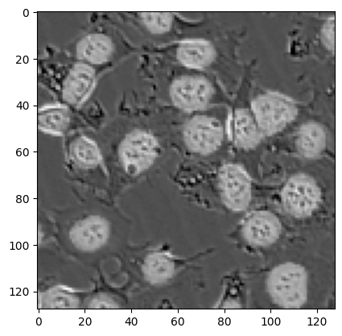
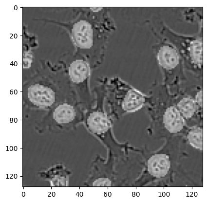
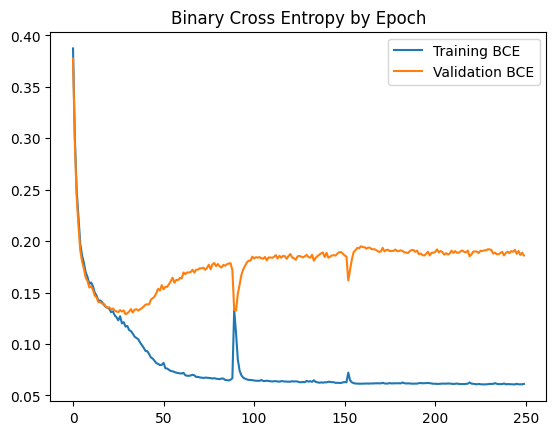
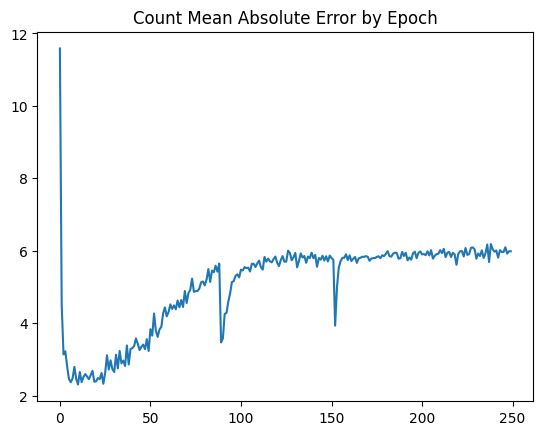

# Cell Counting in Microscopy with U-Net

Count the cells in 128x128 black-and-white microscopy images by predicting a
segmentation mask with a U-Net CNN, then running OpenCV connected-components
on the mask to get a cell count per image.

The course target was a mean absolute error (MAE) below 3 cells per image.
Final result: **MAE ~1.4** on the held-out validation set, beating the
target by ~2x and replacing hand counting on the 1,000-image test set.

Full write-up: [report.pdf](report.pdf).




## How it works

The pipeline is a straight image-to-mask U-Net followed by a counting step:

1. **Segment.** A U-Net predicts a per-pixel cell/background mask. The
   architecture follows the original U-Net paper (Ronneberger et al., 2015,
   [arXiv:1505.04597](https://arxiv.org/pdf/1505.04597)): four encoder
   blocks, a bottleneck, four decoder blocks, with skip-connection
   concatenations between matching resolutions. Twenty-three 3x3 `same`
   convolutions, ReLU, 2x2 max-pool down, nearest-neighbor upsample up.
2. **Count.** Threshold logits at 0, then `cv2.connectedComponents` on the
   binary mask. Number of components minus 1 (background) is the count.

Training:

- 2,000 labeled 128x128 images, 80/20 train/val split (`sklearn.train_test_split`).
- Loss: `BCEWithLogitsLoss` on the per-pixel mask.
- Optimizer: Adam, lr=1.5e-4, batch size 16.
- 250 epochs on a local RTX 4070 Ti (Colab GPU quotas were the bottleneck).
- No augmentations.

Things that were tried and did not help: a deeper 28-conv variant (`UNet3`)
overfit and got worse (MAE ~1.7); a constant additive bias to compensate
for touching cells getting merged by connected-components — best bias was 0.

A subtlety worth flagging: BCE training loss kept suggesting overfit while
count-MAE on the validation set kept improving. The 250-epoch checkpoint
selected on count-MAE was the best submission, not the early-stopped one.




## Repo layout

```
cell_counting.ipynb   Single notebook: data loading, UNet1/2/3, training, eval, submission CSV
report.pdf            Course write-up
assets/               Example input+mask, prediction, training curves
LICENSE               MIT
```

## Reproduce

```bash
jupyter notebook cell_counting.ipynb
```

The notebook expects two NumPy archives in the working directory:

- `train_data.npz` with arrays `X` (2000, 128, 128) and `y` (2000, 128, 128)
- `test_images.npz` with array `X` (1000, 128, 128)

These came from the USF MSDS Kaggle competition
`counting-cells-in-microscopy-images-2024` and are not redistributed here.
The notebook's original `drive.mount(...)` cell can be replaced with a local
path to the same files.

A CUDA-capable GPU is recommended; CPU training is impractical at 250 epochs.

## Credit

USF MS Data Science course project (MATH 373, Spring 2024). Solo project.
Architecture from Ronneberger, Fischer, Brox, *U-Net: Convolutional Networks
for Biomedical Image Segmentation* (2015).
